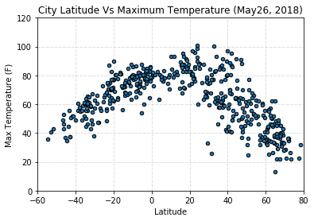
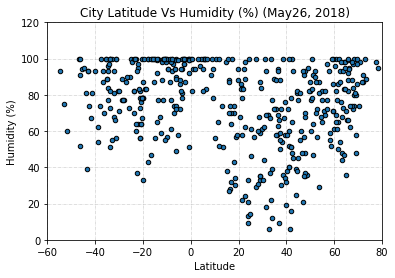
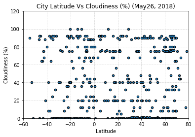
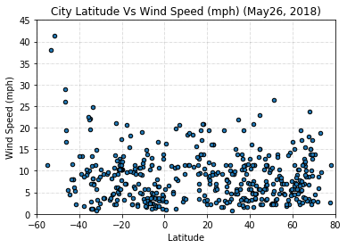

This is a python script to visualize the weather of 500+ cities across the world of varying distance from the equator. The objective is to build a series of scatter plots to showcase the following relationships:

* Temperature (F) vs. Latitude
* Humidity (%) vs. Latitude
* Cloudiness (%) vs. Latitude
* Wind Speed (mph) vs. Latitude

A minimum of 500 cities worldwide will be selected for this exercise based on latitude and longitude for weather visualization. for random selection of latitude and longitude, random module will be utilized, and then using citipy, cities nearest to the selected random latitude/longitude will be obtained.

```python
import pandas as pd
from citipy import citipy
import matplotlib.pyplot as plt
%notebook inline
import random
from config import api_key
import openweathermapy.core as owm
```


```python
#seedify random numbers to obtain repeatable results
random.seed(a=20)
```


```python
city_list=[];country_list=[]
for i in range(0,1200):
    lat=random.randrange(-90,90)
    long=random.randrange(-180,180)
    city=citipy.nearest_city(lat,long)
    city_list.append(city.city_name)
    country_list.append(city.country_code)
df=pd.DataFrame({"City":city_list,"Country":country_list}) 
df.head()
```


<div>
<style scoped>
    .dataframe tbody tr th:only-of-type {
        vertical-align: middle;
    }

    .dataframe tbody tr th {
        vertical-align: top;
    }

    .dataframe thead th {
        text-align: right;
    }
</style>
<table border="1" class="dataframe">
  <thead>
    <tr style="text-align: right;">
      <th></th>
      <th>City</th>
      <th>Country</th>
    </tr>
  </thead>
  <tbody>
    <tr>
      <th>0</th>
      <td>yellowknife</td>
      <td>ca</td>
    </tr>
    <tr>
      <th>1</th>
      <td>noumea</td>
      <td>nc</td>
    </tr>
    <tr>
      <th>2</th>
      <td>tuktoyaktuk</td>
      <td>ca</td>
    </tr>
    <tr>
      <th>3</th>
      <td>taman</td>
      <td>id</td>
    </tr>
    <tr>
      <th>4</th>
      <td>avarua</td>
      <td>ck</td>
    </tr>
  </tbody>
</table>
</div>


After obtaining 500 cities, it is important to check that there are no repeat cities. So, we would need to count all unique combinations of city and country. This is the result I got after various iterations, by manually increasing number of selection to obtain at least 500 unique cities.
1. 268 unique combinations of city, country out of 500 random pickings
2. 448 unique combinations of city, country out of 1000 random pickings
3. 510 unique combinations of city, country out of 1200 random pickings
Seed Number was not changed in these iterations.

```python
# Counting unique combinations of city and country
grped=df.groupby(["Country","City"])
ds=grped.size()
len(ds)
```


    510


```python
df_=ds.to_frame().reset_index()
df_unique_cities=df_[["Country","City"]]
# Creating column with city,country in the format required by openweathermapy
df_unique_cities['city,country']=""
for index,row in df_unique_cities.iterrows():
    row['city,country']=f"{row['City']},{row['Country']}"
df_unique_cities['Lat']="";df_unique_cities['Long']="";df_unique_cities['Temperature(F)']="";df_unique_cities['Humidity(%)']=""
df_unique_cities['Cloudiness(%)']="";df_unique_cities['Wind Speed(mph)']=""
df_unique_cities.head()
```


<div>
<style scoped>
    .dataframe tbody tr th:only-of-type {
        vertical-align: middle;
    }

    .dataframe tbody tr th {
        vertical-align: top;
    }

    .dataframe thead th {
        text-align: right;
    }
</style>
<table border="1" class="dataframe">
  <thead>
    <tr style="text-align: right;">
      <th></th>
      <th>Country</th>
      <th>City</th>
      <th>city,country</th>
      <th>Lat</th>
      <th>Long</th>
      <th>Temperature(F)</th>
      <th>Humidity(%)</th>
      <th>Cloudiness(%)</th>
      <th>Wind Speed(mph)</th>
    </tr>
  </thead>
  <tbody>
    <tr>
      <th>0</th>
      <td>ae</td>
      <td>sharjah</td>
      <td>sharjah,ae</td>
      <td></td>
      <td></td>
      <td></td>
      <td></td>
      <td></td>
      <td></td>
    </tr>
    <tr>
      <th>1</th>
      <td>af</td>
      <td>baraki barak</td>
      <td>baraki barak,af</td>
      <td></td>
      <td></td>
      <td></td>
      <td></td>
      <td></td>
      <td></td>
    </tr>
    <tr>
      <th>2</th>
      <td>ag</td>
      <td>codrington</td>
      <td>codrington,ag</td>
      <td></td>
      <td></td>
      <td></td>
      <td></td>
      <td></td>
      <td></td>
    </tr>
    <tr>
      <th>3</th>
      <td>ai</td>
      <td>the valley</td>
      <td>the valley,ai</td>
      <td></td>
      <td></td>
      <td></td>
      <td></td>
      <td></td>
      <td></td>
    </tr>
    <tr>
      <th>4</th>
      <td>ao</td>
      <td>lucapa</td>
      <td>lucapa,ao</td>
      <td></td>
      <td></td>
      <td></td>
      <td></td>
      <td></td>
      <td></td>
    </tr>
  </tbody>
</table>
</div>


Pulling data from openweathermapI pulled the latitude and longitude of cities to get the exact values
# Pulling Data From openweathermap api


```python
import urllib
settings = {"APPID": api_key, "units": "imperial"}
# keys = ["coord.lon","coord.lat","clouds.all","main.temp", "main.humidity", "wind.speed"]
for index,row in df_unique_cities.iterrows():
    try:
        data=owm.get_current(row['city,country'],**settings)
        row['Lat']=data("coord.lat");row['Long']=data("coord.lat")
        row['Temperature(F)']=data("main.temp");row['Humidity(%)']=data("main.humidity")
        row['Cloudiness(%)']=data("clouds.all");row['Wind Speed(mph)']=data("wind.speed")
        #     data.get_many(keys)
    except urllib.error.HTTPError as err:
        if err==404:
            print(row['city,country'])
            continue
        else:
            print(err)
            print(row['city,country'])

```

    HTTP Error 404: Not Found
    codrington,ag
    HTTP Error 404: Not Found
    ngukurr,au
    HTTP Error 404: Not Found
    acarau,br
    HTTP Error 404: Not Found
    igarape-miri,br
    HTTP Error 404: Not Found
    laguna,br
    HTTP Error 404: Not Found
    bokspits,bw
    HTTP Error 404: Not Found
    longlac,ca
    HTTP Error 404: Not Found
    louisbourg,ca
    HTTP Error 404: Not Found
    saint anthony,ca
    HTTP Error 404: Not Found
    lasa,cn
    HTTP Error 404: Not Found
    warqla,dz
    HTTP Error 404: Not Found
    kemijarvi,fi
    HTTP Error 404: Not Found
    illoqqortoormiut,gl
    HTTP Error 404: Not Found
    marathopolis,gr
    HTTP Error 404: Not Found
    bolungarvik,is
    HTTP Error 404: Not Found
    skagastrond,is
    HTTP Error 404: Not Found
    yomitan,jp
    HTTP Error 404: Not Found
    chardara,kz
    HTTP Error 404: Not Found
    karaton,kz
    HTTP Error 404: Not Found
    asfi,ma
    HTTP Error 404: Not Found
    mananara,mg
    HTTP Error 404: Not Found
    taolanaro,mg
    HTTP Error 404: Not Found
    tsihombe,mg
    HTTP Error 404: Not Found
    grand river south east,mu
    HTTP Error 404: Not Found
    canitas,mx
    HTTP Error 404: Not Found
    san quintin,mx
    HTTP Error 404: Not Found
    camana,pe
    HTTP Error 404: Not Found
    marcona,pe
    HTTP Error 404: Not Found
    mataura,pf
    HTTP Error 404: Not Found
    airai,pw
    HTTP Error 404: Not Found
    amderma,ru
    HTTP Error 404: Not Found
    belushya guba,ru
    HTTP Error 404: Not Found
    chagda,ru
    HTTP Error 404: Not Found
    ishlei,ru
    HTTP Error 404: Not Found
    kadykchan,ru
    HTTP Error 404: Not Found
    kamenskoye,ru
    HTTP Error 404: Not Found
    karaul,ru
    HTTP Error 404: Not Found
    khonuu,ru
    HTTP Error 404: Not Found
    krasnoselkup,ru
    HTTP Error 404: Not Found
    ksenyevka,ru
    HTTP Error 404: Not Found
    mys shmidta,ru
    HTTP Error 404: Not Found
    nizhneyansk,ru
    HTTP Error 404: Not Found
    primore,ru
    HTTP Error 404: Not Found
    sentyabrskiy,ru
    HTTP Error 404: Not Found
    shchelyayur,ru
    HTTP Error 404: Not Found
    tumannyy,ru
    HTTP Error 404: Not Found
    ust-kamchatsk,ru
    HTTP Error 404: Not Found
    sakakah,sa
    HTTP Error 404: Not Found
    barentsburg,sj
    HTTP Error 404: Not Found
    bargal,so
    HTTP Error 404: Not Found
    faya,td
    HTTP Error 404: Not Found
    asau,tv
    HTTP Error 404: Not Found
    karauzyak,uz
    HTTP Error 404: Not Found
    da nang,vn
    HTTP Error 404: Not Found
    halalo,wf
    HTTP Error 404: Not Found
    vaitupu,wf
    HTTP Error 404: Not Found
    saleaula,ws
    HTTP Error 404: Not Found
    samusu,ws
    HTTP Error 404: Not Found
    satitoa,ws
    HTTP Error 404: Not Found
    scottsburgh,za
    HTTP Error 404: Not Found
    umzimvubu,za
    


```python
#changing the datatype from str to numeric
df_unique_cities[["Lat","Long","Temperature(F)","Humidity(%)","Cloudiness(%)","Wind Speed(mph)"]]=df_unique_cities[["Lat","Long","Temperature(F)","Humidity(%)","Cloudiness(%)",
                                                                                                                    "Wind Speed(mph)"]].apply(pd.to_numeric,errors="coerce")
df_unique_cities.count()
```


    Country            510
    City               510
    city,country       510
    Lat                449
    Long               449
    Temperature(F)     449
    Humidity(%)        449
    Cloudiness(%)      449
    Wind Speed(mph)    449
    dtype: int64


Hence, weather data of 449 (out of 510) was returned from openweathermap. We will utilize data of 449 cities for our final plots.

```python
df_unique_cities=df_unique_cities.dropna(axis=0,how="any")
df_unique_cities.to_csv("Output/city_weatherdata.csv")
df_unique_cities.head()
```


<div>
<style scoped>
    .dataframe tbody tr th:only-of-type {
        vertical-align: middle;
    }

    .dataframe tbody tr th {
        vertical-align: top;
    }

    .dataframe thead th {
        text-align: right;
    }
</style>
<table border="1" class="dataframe">
  <thead>
    <tr style="text-align: right;">
      <th></th>
      <th>Country</th>
      <th>City</th>
      <th>city,country</th>
      <th>Lat</th>
      <th>Long</th>
      <th>Temperature(F)</th>
      <th>Humidity(%)</th>
      <th>Cloudiness(%)</th>
      <th>Wind Speed(mph)</th>
    </tr>
  </thead>
  <tbody>
    <tr>
      <th>0</th>
      <td>ae</td>
      <td>sharjah</td>
      <td>sharjah,ae</td>
      <td>25.36</td>
      <td>25.36</td>
      <td>88.20</td>
      <td>46.0</td>
      <td>0.0</td>
      <td>3.36</td>
    </tr>
    <tr>
      <th>1</th>
      <td>af</td>
      <td>baraki barak</td>
      <td>baraki barak,af</td>
      <td>33.97</td>
      <td>33.97</td>
      <td>62.60</td>
      <td>39.0</td>
      <td>0.0</td>
      <td>4.70</td>
    </tr>
    <tr>
      <th>3</th>
      <td>ai</td>
      <td>the valley</td>
      <td>the valley,ai</td>
      <td>18.22</td>
      <td>18.22</td>
      <td>82.47</td>
      <td>74.0</td>
      <td>40.0</td>
      <td>13.87</td>
    </tr>
    <tr>
      <th>4</th>
      <td>ao</td>
      <td>lucapa</td>
      <td>lucapa,ao</td>
      <td>-8.42</td>
      <td>-8.42</td>
      <td>64.81</td>
      <td>77.0</td>
      <td>0.0</td>
      <td>1.70</td>
    </tr>
    <tr>
      <th>5</th>
      <td>ao</td>
      <td>namibe</td>
      <td>namibe,ao</td>
      <td>-15.19</td>
      <td>-15.19</td>
      <td>71.83</td>
      <td>100.0</td>
      <td>0.0</td>
      <td>2.15</td>
    </tr>
  </tbody>
</table>
</div>


# City Latitude Vs Max Temperature (F)


```python
df_unique_cities.plot(kind="scatter",x="Lat",y="Temperature(F)",facecolor="b",edgecolor='black')
plt.title("City Latitude Vs Maximum Temperature (May26, 2018)")
plt.xlabel("Latitude");plt.ylabel("Max Temperature (F)")
plt.grid(linestyle='-.',color='black',linewidth=.5,alpha=.25)
plt.xlim(-60,80);plt.ylim(0,120)
plt.savefig("Output/latvstemp.png")


```





# City Latitude Vs Humidity Plot


```python
df_unique_cities.plot(kind="scatter",x="Lat",y="Humidity(%)",facecolor="b",edgecolor='black')
plt.title("City Latitude Vs Humidity (%) (May26, 2018)")
plt.xlabel("Latitude");plt.ylabel("Humidity (%)")
plt.grid(linestyle='-.',color='black',linewidth=.5,alpha=.25)
plt.xlim(-60,80);plt.ylim(0,120)
plt.savefig("Output/latvshumidity.png")

```





# City Latitude Vs Cloudiness Plot


```python
df_unique_cities.plot(kind="scatter",x="Lat",y="Cloudiness(%)",facecolor="b",edgecolor='black')
plt.title("City Latitude Vs Cloudiness (%) (May26, 2018)")
plt.xlabel("Latitude");plt.ylabel("Cloudiness (%)")
plt.grid(linestyle='-.',color='black',linewidth=.5,alpha=.25)
plt.xlim(-60,80);plt.ylim(0,120)
plt.savefig("Output/latvscloudiness.png")

```





# City Latitude Vs Wind Speed Plot


```python
df_unique_cities.plot(kind="scatter",x="Lat",y="Wind Speed(mph)",facecolor="b",edgecolor='black')
plt.title("City Latitude Vs Wind Speed (mph) (May26, 2018)")
plt.xlabel("Latitude");plt.ylabel("Wind Speed (mph)")
plt.grid(linestyle='-.',color='black',linewidth=.5,alpha=.25)
plt.xlim(-60,80);plt.ylim(0,45)
plt.savefig("Output/latvswind.png")

```





# Conclusions

    1. The cities near equator (0 latitude) have higher maximum temperature, with temperature falling down as the cities go farther from equator.
    2. Humidity and cloudiness show no correlation to the latitudes. Here the data is quite evenly distributed.
    3. Wind speed in most cities are less than 15mph which shows good mild weather today for most places. However some places have wind speed in higher range (15-25mph). In general we do not see any coorelation between wind speed and the latitude.
